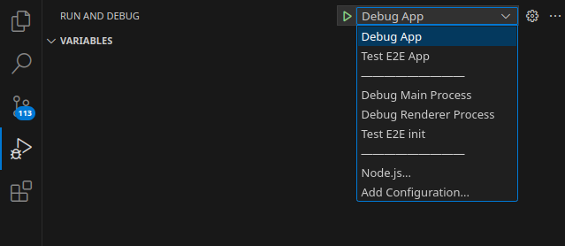
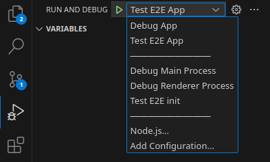

# Krux Installer

[](https://github.com/selfcustody/krux-installer/actions/workflows/build.yml)

Krux Installer (alpha versions) aims to be a GUI based tool to build,
flash and debug [Krux](https://github.com/selfcustody/krux)

As it now, the generated application execute,
without typing any command in terminal.

For more information, see [flash the firmware onto the device](https://selfcustody.github.io/krux/getting-started/installing/#flash-the-firmware-onto-the-device).

## Tested machines

- Linux:
  - Archlinux;
  - Ubuntu;
- Windows:
  - Windows 10

## Untested machines

- MacOS

## Install

- See [releases page](https://github.com/selfcustody/krux-installer/releases);
or

- [Build from source](/#build-from-source)

## Build from source

### Download nodejs

First of all, you will need [Node.js](https://nodejs.org)
installed in you system. We recommend use the latest LTS version.

#### Download from Node.js binaries

You can install node.js in your system downloading it from official
[nodejs website](https://nodejs.org/en/download) and following
provided instructions.

#### Download from NVM (Node Version Manager)

Alternatively, if you have a linux or macos system,
you can have multiple versions of Node.js using [nvm](https://github.com/nvm-sh/nvm).

To install nvm,
follow the [instructions](https://github.com/nvm-sh/nvm#installing-and-updating).

Once installed,
we recomend to install the latest LTS node:

```bash
nvm install --lts
```

### Download repository

Now you can download the source code:

```bash
git clone https://github.com/qlrd/krux-installer.git
```

### Install dependencies

Install all dependencies:

```bash
yarn install
```

Additionaly, you can upgrade dependencies to its latest versions.
Have some caution with this command, once that executing this command
can broke some functionalities, mainly those related to the use of
`google-chrome` and `chromiumdriver` in E2e tests.

**TIP**: Before execute this command, always check the latest supported
`chromium` version at
[Electron Stable Releases page](https://releases.electronjs.org/releases/stable)

```bash
yarn upgrade-interactive --latest
```

### Live compile to development environment

When a change is made, we recommend to execute `dev` subcommand:

```bash
yarn run dev
```

if you want to show some debug messages:

```bash
DEBUG=krux:* yarn run dev
```

##### VSCode/VSCodium

If you're codding with VSCode/VSCodium, go to `Run and Debug`
tab and select `Debug App`:



### Test

#### Prepare tests

To test,
you need to write `specification` tests under `pageobjects` definitions:

- You can write your own [E2E](https://webdriver.io)
specification test files on `test/e2e/specs` folder;

- You can define the [PageObjects] on
`test/e2e/pageobjects` folder.

Before run tests,
you will need to **build** the application.

#### Build

Before running build,
verify [builder config](electron-builder.json5)
to setup the build `target` on specific `os` (Operational System).

The `<target>` depends depends on the running platform
(i.e., `linux`, `darwin` -- MacOS, and `win32` -- Windows).

For more information,
see [Electron Builder](https://www.electron.build/configuration/configuration)
page.

#### Run all tests

The `wdio.conf.mts` is configured to check
if your system have `krux.zip.*` resources.

- If not, it will, run all tests, including download tests;
- If yes, it will skip tests that download resources.

```bash
yarn run build
```

If you want to build a specific `target`
to a specifi `os`, run

```bash
yarn run build --<os> <target>
```

If you want to debug some messages, add the
`DEBUG` environment variable.

In linux/mac:

```bash
DEBUG=krux:* yarn run build --<os> <target>
```

##### Run tests

To run all tests in command line:

```bash
NODE_ENV=test yarn run e2e
```

##### VSCode/VSCodium

If you're codding with VSCode/VSCodium, the `NODE_ENV`
variable is already configured. To run, tests, go to `Run and Debug`
tab and select `Test E2E App`:



##### Filter tests

Additionaly, you can filter some tests with
`--filter` option and a based regular expression argument.

For example, if you want to exclude tests until `25th` test,
you can do this:

```bash
NODE_ENV=test yarn run e2e --filter '0([0-1][0-9]|2[0-4]).*.spec.mts'
```

if you want to debug some messages:

```bash
DEBUG=krux:* NODE_ENV=test yarn run e2e --filter '0([0-1][0-9]|2[0-4]).*.spec.mts'
```

#### WARNING: Builtin OpenSSL for windows in KruxInstaller

When downloading official krux firmware versions,
it is necessary to verify the signature through the OpenSSL tool,
as a way to verify the authenticity of the downloaded binaries.

On "Unix like" releases (Linux and MacOS),
verification is easily done since such tool
exists natively in operating system.

In windows release,
we are faced with the peculiarity of the operating system in question
do not have such a tool
(see this [issue](https://github.com/qlrd/krux-installer/issues/2)).

So, we packaged a stable version of OpenSSL, and
compiled it from the [source](https://github.com/openssl/openssl).
The compilation process is done entirely in a reproducible virtual environment and,
therefore, not locally, with the github-action [compile-openssl-windows-action](https://github.com/qlrd/compile-openssl-windows-action/actions).

Since it is compiled in a virtual environment on github:

- it is expected to be fully verifiable and free of malicious code;
- it is expected that, if you're developing in Windows machine,
some difficulties will be appear.
- You can check the build steps in [actions](https://github.com/qlrd/krux-installer/actions).

## TODOs

- Kendryte K210 devices:
  - [x] Flash to M5stickV;
  - [x] Flash to Sipeed Amigo;
  - [x] Flash to Sipeed Bit;
  - [x] Flash to Sipeed Dock;
  - [ ] Flash to Yahboom Aimotion
  - [ ] Build from source to M5stickV;
  - [ ] Build from source to Sipeed Amigo;
  - [ ] Build from source to Sipeed Bit;
  - [ ] Build from source to Sipeed Dock;
  - [ ] Debug for M5stickV;
  - [ ] Debug for Sipeed Amigo;
  - [ ] Debug for Sipeed Bit;
  - [ ] Debug for Sipeed Dock;
- [odudex Android version](https://github.com/odudex/krux_binaries/tree/main/Android):
  - [ ] Transfer to device;
  - [ ] Build for device;
  - [ ] Debug for device.
- Windows:
  - [x] Build NSIS installer;
  - [ ] Build Portable installer;
  - [ ] Build AppX installer;
- Linux:
  - [x] Build `AppImage` standalone;
  - [ ] Build `deb` package for [apt-get](https://www.debian.org/doc/manuals/apt-howto/);
  - [ ] Build `snap` package for [snapcraft](https://snapcraft.io/);
  - [ ] Build `pacman` package for [pacman](https://wiki.archlinux.org/title/Pacman).
- MacOS:
  - [x] Build DMG installer;
  - [ ] Build PKG installer;
  - [ ] Build MAS installer;
